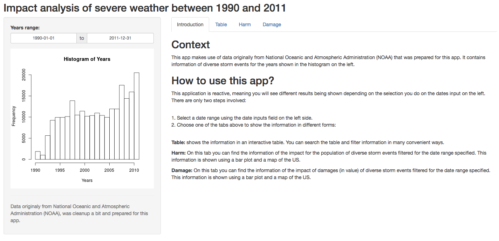

Storm Events Shiny app
================

This is an interactive application written in Shiny, that allows one to explore the storm events reported in the US. This application uses real data collected by the National Oceanic and Atmospheric Administration (NOAA) during the years, although for this application the data was prepared.

Screenshot
----------



Code
----

#### ui.R

``` r
library(shiny)
library(plotly)
library(tidyr)
library(lubridate)

# Define UI for application
shinyUI(fluidPage(
  
  # Application title
  titlePanel("Impact analysis of severe weather between 1990 and 2011"),
  
  # Sidebar with inputs 
  sidebarLayout(
    sidebarPanel(

        dateRangeInput("yearsrange", "Years range:",
                       start  = "1990-01-01",
                       end    = "2011-12-31",
                       min    = "1990-01-01",
                       max    = "2011-12-31",
                       format = "yyyy-mm-dd"),
        plotOutput("histYears"),
        hr(),
        helpText("Data originaly from National Oceanic and Atmospheric Administration (NOAA), 
                 was cleanup a bit and prepared for this app.")
        
    ),
    # Main panel to show the data analysis through tables, plots and maps
    mainPanel(
               tabsetPanel(type = "tabs",
                   tabPanel("Introduction", withTags({
                       div(class="header", checked=NA,
                           h2("Context"),
                           p("This is an interactive application written in Shiny, 
                             that allows one to explore the storm events reported in 
                             the US. This application uses real data collected by 
                             the National Oceanic and Atmospheric Administration (NOAA) 
                             during the years, although for this application the data 
                             was prepared. It contains information of diverse storm 
                             events for the years shown in the histogram on the left."),
                           h2("How to use this app?"),
                           p("This application is reactive, meaning you will see 
                             different results being shown depending on the selection 
                             you do on the dates input on the left. There are only two 
                             steps involved: "),
                           br(),
                           p("1. Select a date range using the date inputs field on 
                             the left side.", 
                             br(),
                             "2. Choose one of the tabs above to show the information in different forms:"),
                           br(),
                           p(strong("Table:"), "shows the information in an interactive table. You can search the table and filter information in many convenient ways."),
                           p(strong("Harm:"), "On this tab you can find the information of the impact for the population of diverse storm events filtered for the date range specified. This information is shown using a bar plot and a map of the US."),
                           p(strong("Damage:"), "On this tab you can find the information of the impact of damages (in value) of diverse storm events filtered for the date range specified. This information is shown using a bar plot and a map of the US.")
                       )
                   })),
                   tabPanel("Table", br(), dataTableOutput("table")),
                   tabPanel("Harm", br(), plotOutput("plotHarm"), br(),
                            plotlyOutput("mapHarm")),
                   tabPanel("Damage", br(), plotOutput("plotDamage"), br(),
                            plotlyOutput("mapDamage"))
                   ) 
       )
    )
))
```

#### server.R

``` r
library(shiny)

# Read the data
stormData <- read.csv("stormdata.txt", stringsAsFactors = FALSE)


# Define server logic required to draw a histogram
shinyServer(function(input, output) {
   
  # Define a reactive behaviour on the input fields for the date
  selectedData <- reactive({
    stormData %>% filter(DATE > as.character(input$yearsrange[1]) & DATE < as.character(input$yearsrange[2]))
  })
  
  # Plot a histogram of the dates to show for which data is available
  output$histYears <- renderPlot({
      hist(year(stormData$DATE), xlab = "Years", main = "Histogram of Years")
  })
  
  # render a data table so user can navigate on the date
  output$table <- renderDataTable(selectedData())
    
  # render a segmented plot to show the numbers of harm produced by each event 
  # in the selected dates interval
  output$plotHarm <- renderPlot({

    aggregatedResultsHarm <- selectedData() %>%
        group_by(EVTYPE) %>%
        summarise( Fatality = sum(FATALITIES), Injury = sum(INJURIES), total = Fatality + Injury)

    resultsHarm <- gather(aggregatedResultsHarm, Fatality, Injury, key = Harm, value = cases)

    resultsHarmGraph <- ggplot(resultsHarm, aes(x = reorder(EVTYPE, -cases), y = cases, fill = Harm)) + geom_bar(stat = "identity")

    resultsHarmGraph <- resultsHarmGraph + labs(x = "Event type", y = "Number of people affected", title = "Impact analysis of severe weather on public health")

    resultsHarmGraph <- resultsHarmGraph + scale_fill_manual(values = c("skyblue", "royalblue")) + theme(axis.text.x=element_text(size=6.6))

    resultsHarmGraph <- resultsHarmGraph + coord_flip()

    resultsHarmGraph
  })

  # render a segmented plot to show the values of damage by each event
  # in the selected dates interval
  output$plotDamage <- renderPlot({

    aggregatedResultsDamage <- selectedData() %>%
        group_by(EVTYPE) %>%
        summarise( Property = sum(PROPDMGSTDUNIT), Crop = sum(CROPDMGSTDUNIT), total = Property + Crop)

    resultsDamage <- gather(aggregatedResultsDamage, Property, Crop, key = Damage, value = cases)

    resultsDamageGraph <- ggplot(resultsDamage, aes(x = reorder(EVTYPE, -cases), y = cases, fill = Damage)) + geom_bar(stat = "identity")

    resultsDamageGraph <- resultsDamageGraph + labs(x = "Event type", y = "Value of the damage (in Billions)", title = "Impact analysis of severe weather on property")

    resultsDamageGraph <- resultsDamageGraph + scale_fill_manual(values = c("skyblue", "royalblue"))

    resultsDamageGraph <- resultsDamageGraph + coord_flip()

    resultsDamageGraph
  })

  # render a choropleth map to show the numbers of harm produced by each event
  # in the selected dates interval in a map
  output$mapHarm <- renderPlotly({

      summaryHarm <- selectedData() %>%
          group_by(STATE) %>%
          summarise( Fatality = sum(FATALITIES), Injury = sum(INJURIES), total = Fatality + Injury) %>%
          mutate(hover = paste("Fatality: ", Fatality, '<br>', "Injury: ", Injury))

      g <- list(
          scope = 'usa',
          projection = list(type = 'albers usa')
          )

      plot_geo(summaryHarm, locationmode = 'USA-states') %>%
          add_trace(
              z = ~total,
              locations = ~STATE,
              text = ~hover,
              color = ~total, colors = 'Blues'
          ) %>%
          colorbar(title = "Total Number") %>%
          layout(
              title = 'Impact analysis of severe weather on public health per state',
              geo = g
          ) %>%
          config(displayModeBar = F)

        })

  # render a choropleth map to show the values of damage by each event
  # in the selected dates interval in a map
  output$mapDamage <- renderPlotly({

      summaryDamage <- selectedData() %>%
          group_by(STATE) %>%
          summarise( Property = sum(PROPDMGSTDUNIT), Crop = sum(CROPDMGSTDUNIT), total = Property + Crop) %>%
          mutate(hover = paste("Property: ", round(Property, digits = 0), '<br>', "Crop: ", round(Crop, digits = 0)))

      g <- list(
          scope = 'usa',
          projection = list(type = 'albers usa')
      )

      plot_geo(summaryDamage, locationmode = 'USA-states') %>%
          add_trace(
              z = ~round(total, digits = 0),
              locations = ~STATE,
              text = ~hover,
              color = ~total, colors = 'Blues'
          ) %>%
          colorbar(title = "Billions USD") %>%
          layout(
              title = 'Impact analysis of severe weather on property',
              geo = g
          ) %>%
        config(displayModeBar = F)

  })
})
```
